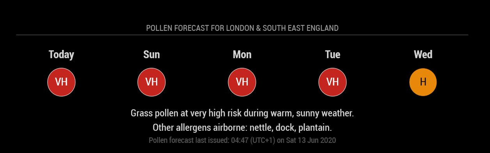

# mmm-uk-pollen-forecast
A module for MagicMirror<sup>2</sup> that displays pollen data for your area in the UK.

</img>

British pollen sufferers unite!
This module scrapes the [Met Office website](https://www.metoffice.gov.uk/weather/warnings-and-advice/seasonal-advice/pollen-forecast) for the pollen forecast for your magic mirror, so you have advance notice of what level of misery you can expect in the coming days. Unfortunately the Met Office do not provide a free or low-cost API for pollen data, so we have to resort to more fragile methods. 


Notes: 

- this module maybe useful to anyone who wants to scrape a website for use on a mirror. No iframes here! We parse the target website with cheerio, then dump out the html to a cache file. Then the client-side script picks this up for display. (Is there an XSS vulnerability? Maybe, if the Met Office is hacked.)
- this module only supports the UK.
- the module is likely to break if the Met Office website changes.
- Pull requests, bug reports and feature requests [are welcome.](https://github.com/szech/mmm-uk-pollen-forecast) 
- I am not a js coder, so please don't judge too harshly :)

Thanks to Michael Teeuw for this great platform, and to the other mm modules for inspiration and open source code 
(*・ω・)ﾉ


## Config
| **Option** | **Description** |
| --- | --- |
| `update_interval_hours` | (optional) Set to desired update interval (in hours), default is `2`. |
| `region` | your region. required. see below for the possible values. |
| `first_display_date_DD_MM` | optional. will show the module from this date onwards. format: DD-MM  |
| `last_display_date_DD_MM` | optional. will hide the module after this date onwards until next year. format: DD-MM. see below for more details |
| `days_to_show`       | optional. choose how many forecast days to show. range is 0 - 5, where 0 will hide all the icons, 5 is the maximum and the default |
| `show_forecast_text`     |   optional. choose to show or hide the forecast text. default is  `'true'` (show the text.) set as `'false'` to hide it.   |
| `show_forecast_last_issued_text`     |   optional. choose to show or hide the forecast text. default is  `'true'` (show the text.) set as `'false'` to hide it.   |


## Regions

pick the 2-letter code that corresponds to your region and use this in the config.

|  Region | Corresponds to...  |
| --- | --- |
|  os  |  Orkney & Shetland    |
|  ta  |  Central, Tayside & Fife  |
|  he  |  Highlands & Eilean Siar  |
|  gr  |  Grampian  |
|  st  |  Strathclyde  |
|  dg  |  Dumfries, Galloway, Lothian & Borders  |
|  ni  |  Northern Ireland  |
|  wl  |  Wales  |
|  nw  |  North West England  |
|  ne  |  North East England  |
|  yh  |  Yorkshire & Humber  |
|  wm  |  West Midlands  |
|  em  |  East Midlands  |
|  ee  |  East of England  |
|  sw  |  South West England  |
|  se  |  London & South East England  |

## First Display Date & Last Display Date

Since pollen is a seasonal affliction, you can configure when you want the module to be visible using `first_display_date_DD_MM` & `last_display_date_DD_MM` in the config.

The format must be `DD-MM` e.g. `01-04` ==> 1st April.
If you want it to display all year round, you can use a blank entry `''` or `'always'`.

Note: the Met Office only issues forecasts between mid-March and mid-September.
The module won't display anything if the forecast is not available on the Met Office website.

You can check the general seasonality of pollen with the University of Worcester's [seasonal pollen calendar](
https://www.worcester.ac.uk/about/academic-schools/school-of-science-and-the-environment/science-and-the-environment-research/national-pollen-and-aerobiology-research-unit/pollen-calendar.aspx)


## Installation

  1. Clone this repo into your magic mirror `modules` directory. 
  2. cd in there and run `npm install`
  2. Create an entry in your `config.js` file to tell this module where to display on screen.
  3. Make sure you set the region in your config entry. see table for possible values.
  4. Reload/refresh magic mirror
  5. Profit!


 **Example config.js entry:**
```
 {
    module: 'mmm-uk-pollen-forecast',
    position: 'bottom_center',
    config: {
        update_interval_hours : 2,    // update every 2 hrs
        region : 'se',              // forecast for London & SE England
        first_display_date_DD_MM: '01-04', // show module from 1st April
        last_display_date_DD_MM: '01-09',  // hide module after 1st September
        days_to_show: 3,             // only show forecast for next 3 days
        show_forecast_text: 'false'    // hide the forecast text
        show_forecast_last_issued_text: 'true' // show when forecast was last issued
    }
 },
```


## troubleshooting:
- try `npm install -g` in step 2 
- refresh the browser window where the mirror is displayed
- restart the mm server
- double check the config.js entry. 
  - maybe you need to add quotes around the values
  - maybe you forgot a comma to end the line 
- have you configured the module to be hidden?
- the module won't show anything outside of pollen season because the Met Office doesn't issue any forecasts.
- forecast is too wide? just uncomment and fiddle `max-width` in `pollen-forecast.css`
- do you have enough antihistamines?
- avoid alcohol, it tends to make your hayfever symptoms worse :'(


